# WMS AI Agent 当前实现设计文档

> 基于 `/Users/yangpei/wms-ai-investigator/src` 当前代码整理，更新时间：2026-04-10。  
> 本文以源码为准；`README.md` 和旧版设计文档仅作为辅助参考。

## 1. 背景

`WMS AI Agent` 是一个面向 `Codex` 的本地 MCP 调查底座。它把“项目边界、仓库目录、日志目录、数据源、知识库、记忆、只读查询能力、工具扩展能力”统一封装到一个本地运行的 TypeScript 服务中，目标是让模型先理解上下文，再安全地调用排查工具。

当前实现的核心边界来自以下代码：

- MCP 启动入口在 `src/index.ts`
- 工具注册与执行运行时在 `src/tools.ts`
- 文件工作区解析在 `src/store.ts`
- 工作区骨架与写操作在 `src/workspace-files.ts`
- SQL / Mongo / Kafka / Logcenter 适配在 `src/datasources.ts`
- Grafana / SkyWalking 适配在 `src/monitor-datasources.ts`
- 本地配置 UI 在 `src/config-ui.ts`

### 1.1 设计目标

1. 让 `Codex` 能以项目为边界读取手册、知识库、历史记忆和数据源，而不是盲查整台机器。
2. 让 SQL / Mongo / Kafka / 日志 / 代码检索默认保持只读，降低误操作风险。
3. 让工作区配置完全落盘到本地文本文件，方便人工维护、版本管理和快速迁移。
4. 让工具能力可插拔，支持本地模块、远程 catalog 和热重载。
5. 提供一个很薄的配置页，降低手工改 `.env` / `.md` / `.txt` 的门槛。

### 1.2 非目标

- 不提供聊天工作台或会话产品
- 不做线上多租户配置中心
- 不做自动写库修复
- 不做复杂前后端分离 Web 产品
- 不把敏感凭证直接暴露给模型工具输出

### 1.3 当前代码范围说明

当前真正有效的实现几乎全部集中在 `src/`：

- `apps/`、`packages/` 目录目前基本为空壳，未形成真实模块边界
- 编译产物输出到 `build/`，由 `tsconfig.json` 的 `outDir` 控制
- `package.json` 的包版本是 `0.1.0`，但 `createServer()` 向 MCP 报告的服务版本是 `0.4.0`，存在元数据不一致

## 2. 业务架构

从业务视角看，`WMS AI Agent` 不是业务系统本身，而是一个“本地调查编排器”。它服务于三类角色：

- `Codex`：通过 MCP 自动调用工具
- 调查维护者：维护工作区、项目、数据源、知识库和记忆
- 外部系统：数据库、Kafka、日志中心、Grafana、SkyWalking、本地仓库和日志目录

### 2.1 主业务流程

1. `Codex` 启动时先读取工作区说明、项目目录和调查手册。
2. 根据用户问题选择一个或多个项目边界。
3. 在项目边界内解析仓库目录、日志目录和绑定数据源。
4. 再调用只读工具查询 SQL / Mongo / Kafka / Grafana / 日志 / 代码。
5. 如果结论有复用价值，把方法写入 `memory/patterns`，把具体事件写入 `memory/cases`。
6. 如果需要新增能力，则通过 Tool Module / Tool Store 安装外部模块。

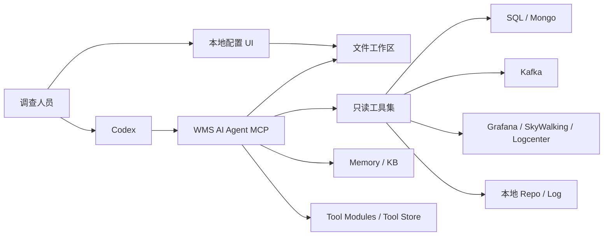

## 3. 技术架构

### 3.1 总体分层

当前实现不是传统三层 Web 应用，而是“本地文件配置 + MCP 工具运行时 + 薄配置页”的组合体。

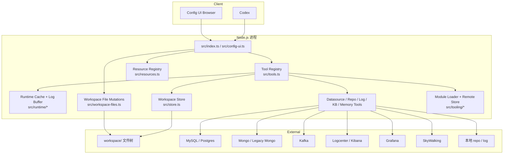

### 3.2 启动路径

`src/index.ts` 非常薄，只做三件事：

1. `resolveStorePath()` 解析工作区目录
2. `createServer(storePath)` 创建 MCP Server
3. 用 `StdioServerTransport` 暴露到 `Codex`

配置 UI 的入口是 `src/config-ui.ts`，它单独起一个本地 HTTP 服务，默认监听 `127.0.0.1:3789`，并不复用 MCP 传输层。

## 4. 代码模块划分

### 4.1 MCP 启动与服务注册

- `src/index.ts`
  - 标准 MCP stdio 入口
- `src/tools.ts`
  - 创建工具注册表
  - 组装内建工具模块
  - 执行参数校验、缓存、运行日志、递归保护
  - 在 MCP server 中动态注册/更新/删除工具
- `src/resources.ts`
  - 把工作区文档注册成 MCP Resource

### 4.2 文件工作区层

- `src/store.ts`
  - 负责把文件工作区读成 `ConfigStore`
  - 支持旧版“单 JSON 文件”兼容读取
  - 从 `datasources.txt` 建立项目与数据源的实际绑定关系
- `src/workspace-files.ts`
  - 负责创建骨架目录
  - 负责项目/数据源增删改名
  - 负责 `datasource.env`、`secret.env`、`project.env` 等文件写回

### 4.3 数据源与检索层

- `src/datasources.ts`
  - SQL 只读
  - Mongo 原生 + 兼容旧版 shell / Python fallback
  - Kafka admin 查询
  - Logcenter 登录与搜索
- `src/monitor-datasources.ts`
  - Grafana 搜索 / 面板读取 / 面板查询
  - SkyWalking 服务检索 / trace 查询
- `src/tooling/search-helpers.ts`
  - 基于 `rg` 做本地仓库和日志搜索

### 4.4 知识、记忆与调查编排层

- `src/tooling/catalog-tools.ts`
  - 工作区 / 项目 / KB / Memory / Datasource 工具
  - Memory pattern / case 的去重与沉淀
- `src/tools.ts`
  - 同步失败高阶工具 `trace_sync_failure` / `trace_sync_entity_failure`
  - repo/log/runtime/hub 工具

### 4.5 扩展层

- `src/tooling/module-loader.ts`
  - 外部工具模块发现、加载、启停、卸载、热监听
- `src/tooling/remote-store.ts`
  - 远程 Tool Store catalog 管理与安装
- `tool-store/packages/project-snapshot/*`
  - 本地示例包

### 4.6 配置 UI 层

- `src/config-ui.ts`
  - 单文件内嵌 HTML/CSS/JS
  - 暴露 `/api/state`、`/api/file`、`/api/datasource/config` 等 HTTP 接口
  - 通过 `runToolLocally()` 复用 MCP 工具能力，而不是重复实现后台逻辑

### 4.7 预备能力

- `src/remote-wms-agent.ts`
  - 已实现远端 WMS Agent 登录、线程列表、发起 turn、SSE 等待结果
  - 但当前没有接入 `src/tools.ts` 的工具注册，也没有接入 `testDatasource()` 的类型分发
  - 结论：该文件属于“已写好但尚未接线”的能力

## 5. 工作区与数据模型

### 5.1 文件工作区结构

`src/store.ts` 和 `src/workspace-files.ts` 共同定义了当前的文件工作区模型：

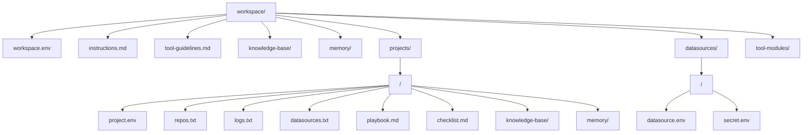

### 5.2 关系模型

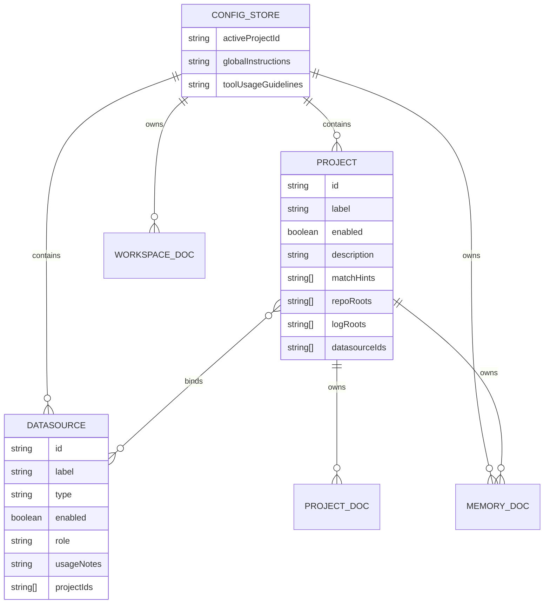

### 5.3 核心配置对象

| 对象 | 来源文件 | 关键字段 | 说明 |
|---|---|---|---|
| `ConfigStore` | `src/types.ts` | `activeProjectId`、`projects[]`、`datasources[]` | MCP 运行时的总配置快照 |
| `ProjectConfig` | `projects/<id>/project.env` 等 | `repoRoots`、`logRoots`、`datasourceIds` | 调查边界的最小单元 |
| `DataSourceConfig` | `datasources/<id>/datasource.env` + `secret.env` | `type`、`connection.*`、`auth.*` | 共享数据源配置 |

### 5.4 绑定优先级

代码里已经明确：

1. 项目实际可见的数据源，以 `projects/<project-id>/datasources.txt` 为准
2. `datasource.env` 中的 `PROJECT_IDS` 只作为补充元数据和写回信息
3. `normalizeRelationships()` 会双向补齐 project / datasource 关系，但不会让未绑定数据源越权暴露

这意味着项目边界控制不是“凭 datasource 自报绑定”，而是“以项目目录声明为主”。

## 6. 工具与资源设计

### 6.1 MCP Resource 设计

`src/resources.ts` 会把下列文档注册为资源：

- `instructions.md`
- `tool-guidelines.md`
- `knowledge-base/**/*.md`
- `memory/**/*.md`
- `projects/*/playbook.md`
- `projects/*/checklist.md`

资源 URI 采用：

```text
wms-ai:///workspace/<encoded-relative-path>
```

一个细节需要注意：

- 资源内容读取是实时读文件
- 但资源列表是在 `createServer()` 时一次性注册的
- 结论：修改已有文档可以立即读到，新增文档不重启进程则不会自动出现在资源列表里

### 6.2 工具分类

当前内建工具大致分成下面几组：

| 分类 | 代表工具 | 实现位置 | 说明 |
|---|---|---|---|
| workspace/project | `workspace_playbook`、`project_catalog`、`project_playbook` | `src/tooling/catalog-tools.ts` | 让模型先理解工作区和项目边界 |
| knowledge-base | `kb_catalog`、`kb_read`、`kb_search` | `src/tooling/catalog-tools.ts` | 读取静态知识 |
| memory | `memory_*` | `src/tooling/catalog-tools.ts` | 搜索、写入 pattern / case |
| datasource | `datasource_overview`、`resolve_datasource_for_intent`、`datasource_test` | `src/tooling/catalog-tools.ts` | 统一解析数据源 |
| sql/mongo/kafka | `sql_*`、`mongo_*`、`kafka_*` | `src/tools.ts` + `src/datasources.ts` | 只读查询 |
| log/monitor | `logcenter_search`、`monitor_*`、`log_search` | `src/tools.ts` + `src/datasources.ts` + `src/monitor-datasources.ts` | 日志与监控证据 |
| repo | `repo_search`、`repo_read_file` | `src/tools.ts` | 本地代码搜索与精读 |
| sync | `trace_sync_failure`、`trace_sync_entity_failure` | `src/tools.ts` | 高阶调查入口 |
| runtime/hub | `runtime_*`、`hub_*` | `src/tools.ts` | 运行时观察与元调用 |
| module/store | `tool_module_*`、`tool_store_*` | `src/tools.ts` + `src/tooling/*` | 模块与商店管理 |

### 6.3 工具执行模型

`src/tools.ts` 的执行器具备以下特性：

- 用 `zod` 做参数校验
- 支持按工具粒度设置 `cacheTtlMs`
- 运行日志写入 `RuntimeLogBuffer`
- 递归深度限制为 8 层
- 阻止 `hub_invoke` / `hub_exec` 递归调用自己
- 工具模块热更新后，MCP 工具列表会同步刷新

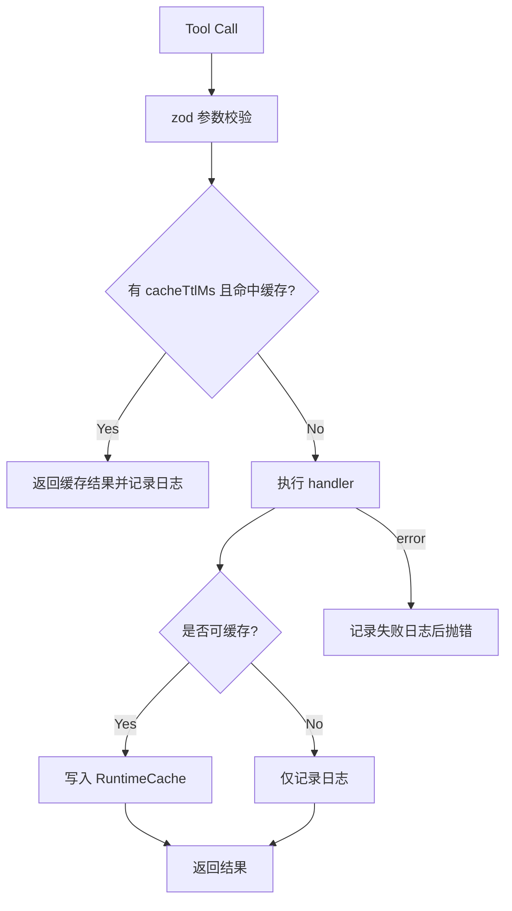

## 7. 数据源适配设计

### 7.1 SQL

实现文件：`src/datasources.ts`

特点：

- 只允许 `SELECT / WITH / SHOW / DESCRIBE / DESC / EXPLAIN`
- 明确拦截 `insert/update/delete/drop/alter/create` 等关键词
- 支持 `mysql2/promise` 和 `pg`
- `sql_describe_schema_readonly` 统一通过 `information_schema` 做 schema / table introspection

### 7.2 Mongo

实现文件：`src/datasources.ts`

特点：

- 支持 `native`、`legacy-shell`、`auto`
- `auto` 模式会优先尝试原生 `MongoClient`，失败后回退兼容链路
- 兼容链路支持：
  - `WMS_AI_AGENT_LEGACY_PYTHON`
  - 本地 `python3 + pymongo<4`
  - `mongosh`
  - `mongo`

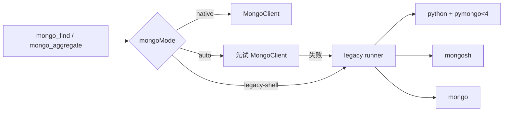

### 7.3 Kafka

实现文件：`src/datasources.ts`

特点：

- 只暴露 Kafka Admin 能力
- 已支持 `plain / scram-sha-256 / scram-sha-512`
- 当前没有 consumer / producer 业务调用，只用于偏观测的 offset / lag 查询

### 7.4 Logcenter

实现文件：`src/datasources.ts`

特点：

- 支持 `basic` 和 `form` 两种登录模式
- 能解析 `DATA_VIEW`
- 返回 hits 时会做 summary / preview 提取，避免直接把整条 `_source` 原样抛给上层

### 7.5 Grafana / SkyWalking

实现文件：`src/monitor-datasources.ts`

Grafana 侧：

- 搜 dashboard / folder / datasource
- 读 dashboard / panel / folder / datasource 详情
- 直接执行 panel query，并把 frame 归一化

SkyWalking 侧：

- 搜 service
- 读 service / trace
- 结构化查询 traces

### 7.6 `wms_agent` 现状

代码上已经有 `wms_agent` 数据源类型声明和配置 UI 表单：

- `src/types.ts`
- `src/store.ts`
- `src/workspace-files.ts`
- `src/config-ui.ts`

但当前仍有两个关键缺口：

1. `testDatasource()` 不支持 `wms_agent`，会落到 `Unsupported datasource type`
2. `src/remote-wms-agent.ts` 没有被 `src/tools.ts` 注册成可调用工具

结论：`wms_agent` 目前属于“配置模型已准备、执行链路未闭环”的半成品能力。

## 8. 知识库、记忆与高阶调查

### 8.1 Knowledge Base / Memory 分层

`src/tooling/catalog-tools.ts` 把工作区文档分为两类：

- `knowledge-base`
  - 描述稳定结构、规则、架构和通用模式
- `memory`
  - 记录历史案例
  - 其中再拆成 `patterns` 和 `cases`

### 8.2 Memory 写入模型

`memory_record_case` 的行为不是简单写文件，而是：

1. 基于 `dedupeKey` 查重
2. 已存在则提升 `Occurrence Count`
3. 写入 `Data Evidence / Code Evidence / Log Evidence` 三类 JSON 证据
4. 如果带了 `patternKey/patternTitle`，同步更新对应 pattern 文档

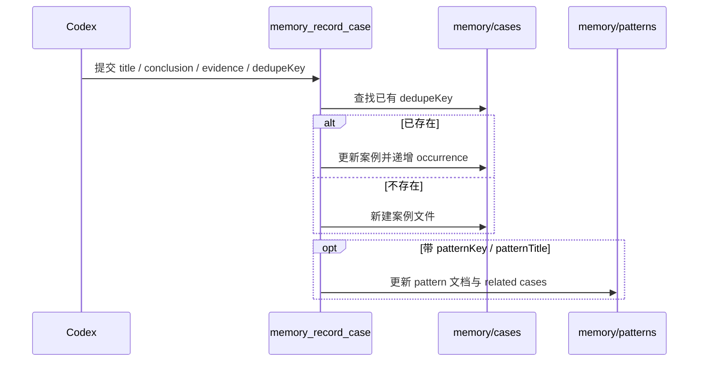

### 8.3 高阶同步排查工具

`trace_sync_failure` 和 `trace_sync_entity_failure` 是当前最像“调查编排器”的工具：

- 自动解析项目
- 自动挑选最佳 Mongo 数据源
- 从 `sync_failed_info` 拉样本与聚合
- 自动生成 `dataEvidence`
- 再补充 `repo_search` 与 `log_search` 的结构化证据

实体预设目前包括：

- `lp`
- `order`
- `inventory`
- `receipt`
- `item`
- `customer`
- `adjustment`

## 9. Tool Module 与 Tool Store

### 9.1 模块来源

`src/tooling/module-loader.ts` 当前支持三类模块来源：

- 内建模块
- 工作区 `tool-modules/`
- 从本地 tool store / 远程 tool store 安装进工作区的外部模块

### 9.2 生命周期

模块支持：

- catalog
- reload
- watch status
- set enabled
- uninstall
- install local
- install remote

热加载通过 `fs.watch()` + 400ms debounce 实现。工具模块变化后，`createServer()` 内部会重新同步 MCP 工具列表。

### 9.3 远程 Tool Store

`src/tooling/remote-store.ts` 的设计是：

- 远程源配置保存在 `~/.wms-ai-agent/tool-store/remote-sources.json`
- 远程 catalog 必须是 HTTP/HTTPS JSON
- 远程安装只拉两类文件：
  - `manifest.json`
  - `entry` 指向的 `module.js`

这个设计的优点是简单、可控；代价是远程包必须尽量自包含。

## 10. 配置 UI 设计

### 10.1 页面定位

配置 UI 不是业务产品，而是本地工作区编辑器。`src/config-ui.ts` 单文件内嵌了：

- HTML 结构
- 样式
- 前端状态与交互脚本
- Node HTTP 路由

### 10.2 页面布局

当前 UI 是三栏工作区编辑器：


关键能力包括：

- 浏览工作区树
- 编辑任意配置文件
- 用结构化表单编辑数据源
- 创建 / 删除 / 重命名项目和数据源
- 绑定 / 解绑项目与数据源
- 设默认项目
- 测试数据源
- 管理 Tool Module / Tool Store / Remote Source

### 10.3 HTTP API 视图

配置 UI 的接口主要是文件维护和工具代理两类：

| Method | Path | 作用 | 实现 |
|---|---|---|---|
| GET | `/api/state` | 返回工作区树和 store 快照 | `src/config-ui.ts` + `buildWorkspaceTree()` |
| GET/POST | `/api/file` | 读写工作区文件 | `readWorkspaceFile()` / `writeWorkspaceFile()` |
| POST | `/api/project/create` | 创建项目骨架 | `createProjectSkeleton()` |
| POST | `/api/datasource/create` | 创建数据源骨架 | `createDatasourceSkeleton()` |
| POST | `/api/project/bind-datasource` | 绑定项目与数据源 | `bindDatasourceToProject()` |
| POST | `/api/datasource/config` | 保存数据源表单 | `writeDatasourceConfig()` |
| POST | `/api/datasource/test` | 测试数据源 | `testDatasource()` |
| GET/POST | `/api/tool-modules/*` | 模块与商店管理 | `runToolLocally()` 代理到 MCP 工具 |

### 10.4 配置保存流程

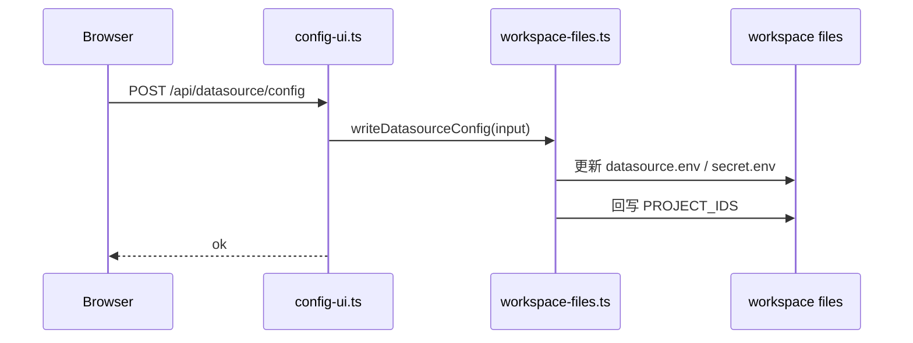

## 11. 关键时序图

### 11.1 MCP 启动时序

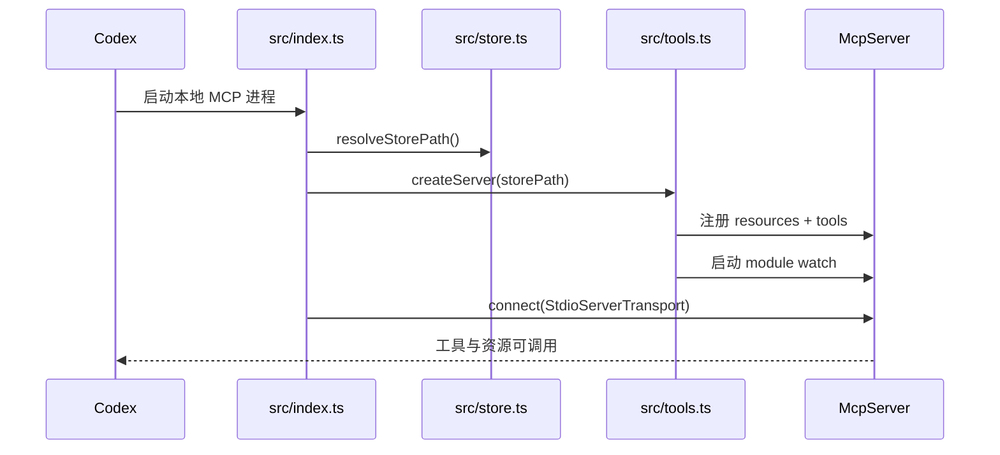

### 11.2 一次标准调查时序

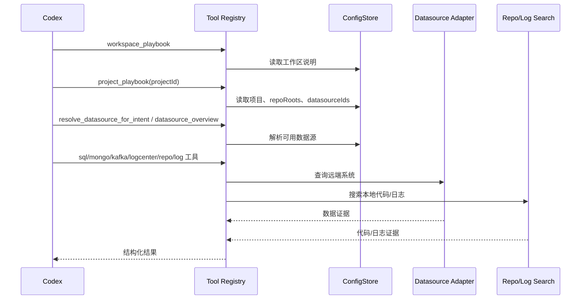

### 11.3 外部工具模块安装时序

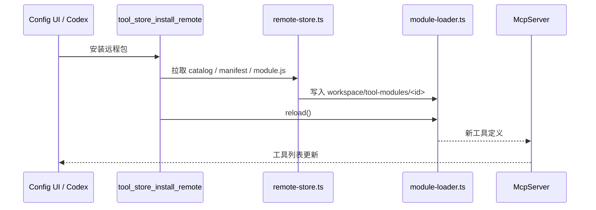

## 12. 非功能特征

### 12.1 安全

优点：

- SQL 明确只读
- Kafka 只开放 admin 查询
- 本地路径通过 `resolvePathUnderRoot()` 防止越界
- 数据源摘要不会把 `secret` 原样返回

限制：

- `secret.env` 仍是明文落盘
- 配置 UI 没有认证，只靠 `127.0.0.1` 绑定降低暴露面
- 远程 Tool Store 安装的是任意远端 `module.js`，属于高信任模型

### 12.2 性能

- `repo_search` / `log_search` 基于 `rg`
- 高频 catalog / runtime / schema 工具带短 TTL 缓存
- `runLocalCommand()` 有超时控制

### 12.3 稳定性

- 工具调用全部写入运行日志
- 模块热加载有 debounce
- Mongo 兼容模式提供原生失败回退

### 12.4 可观测性

- `runtime_recent_calls`
- `runtime_cache_stats`
- 进程级 stderr 启动日志

### 12.5 可维护性

当前可维护性中等：

- 文件工作区模型清晰
- 数据源适配分层明确
- 但 `src/config-ui.ts` 和 `src/tools.ts` 体量过大，维护成本正在上升

## 13. 风险、差距与取舍

### 13.1 已确认风险

1. `wms_agent` 能力未闭环  
   类型、表单、文件模型已支持，但工具注册和数据源测试未接上。

2. 资源列表不是动态发现  
   新增 KB/Memory 文件后，不重启进程不会出现在 MCP Resource 列表里。

3. 配置 UI 过于集中  
   `src/config-ui.ts` 近 3000 行，HTML/CSS/JS/HTTP 路由混在一个文件中。

4. 代码有重复辅助逻辑  
   `src/tools.ts` 与 `src/tooling/shared.ts` 存在一批重复或高度相似的 helper，说明抽象仍在迁移中。

5. 版本信息不一致  
   `package.json` 为 `0.1.0`，MCP server 对外声明 `0.4.0`。

6. 缺少自动化测试  
   当前可见的是 `npm run check` 类型检查，没有看到系统化测试目录。

### 13.2 当前取舍

- 选择“文件工作区”而不是数据库配置中心  
  取舍结果是实现简单、可审计、易迁移，但缺少并发编辑与权限治理。

- 选择“只读工具优先”  
  取舍结果是安全性高，但自动修复能力弱。

- 选择“本地配置 UI + MCP 共存”  
  取舍结果是兼顾人工维护和模型调用，但产生两套入口，需要持续保持一致。

## 14. 后续建议

### 14.1 短期

1. 把 `remote-wms-agent.ts` 真正接入 `datasource_test` 和工具注册。
2. 为资源注册增加“刷新资源列表”能力，避免新增文档必须重启。
3. 修复版本号不一致问题。
4. 为 `resolve_datasource_for_intent` 补上 `wms_agent` 类型支持。

### 14.2 中期

1. 把 `src/config-ui.ts` 拆成：
   - HTML/前端脚本
   - HTTP 路由
   - 工具代理层
2. 把 `src/tools.ts` 与 `src/tooling/shared.ts` 的重复 helper 收敛到共享层。
3. 为关键流程补测试：
   - store 解析
   - datasource 只读校验
   - module loader
   - config UI 文件写回

### 14.3 长期

1. 把 `apps/` / `packages/` 真正用起来，完成模块化拆分。
2. 给外部模块和远程模块增加更强的签名、校验或白名单机制。
3. 视需要把配置 UI 演进成独立前端，但仍保持“文件工作区优先”的核心设计。
