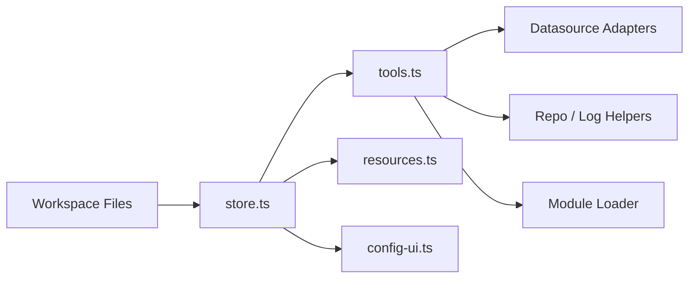

# Architecture

`wms-ai-agent` is organized around a file-backed workspace plus a read-only MCP tool layer.

## Components

1. `src/store.ts`
   - loads and normalizes the workspace files
   - resolves the default workspace path
   - keeps project and datasource relationships consistent

2. `src/workspace-files.ts`
   - creates and edits the on-disk workspace structure
   - provides field guides for the config UI

3. `src/tools.ts`
   - registers MCP tools
   - routes tool calls to datasource adapters, repo/log helpers, and extension modules

4. `src/datasources.ts`
   - implements read-only SQL, Mongo, Kafka, and logcenter access

5. `src/monitor-datasources.ts`
   - handles monitor and tracing backends

6. `src/resources.ts`
   - exposes workspace markdown as MCP resources

7. `src/config-ui.ts`
   - serves a local-only editor for workspace files and datasource metadata

8. `src/tooling/*`
   - handles module loading, tool cataloging, and tool-store installs

## Data flow

## Workspace contract

The workspace is the source of truth. That keeps the system inspectable and easy to version:

- `workspace.env`, `instructions.md`, `tool-guidelines.md`
- `projects/<id>/*`
- `datasources/<id>/*`
- optional `knowledge-base/` and `memory/`

## Security boundary

- Credentials are isolated in `secret.env`.
- Built-in data access tools reject write operations.
- The config UI binds to `127.0.0.1`.

## Extension model

The tool module loader supports:

- built-in tools
- workspace-provided external modules
- local and remote tool-store packages

That makes it possible to keep the core server small while adding domain-specific tooling per workspace.
